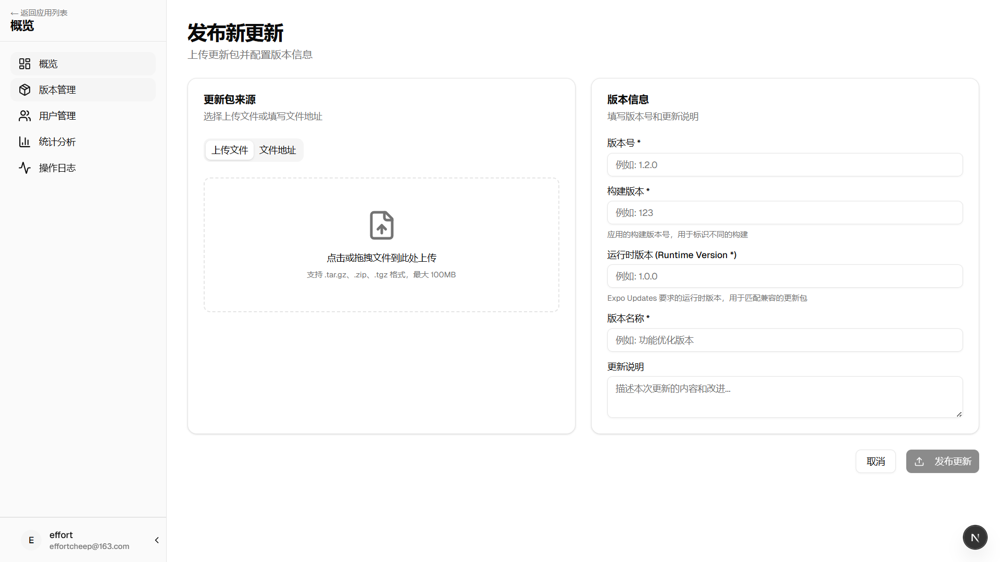
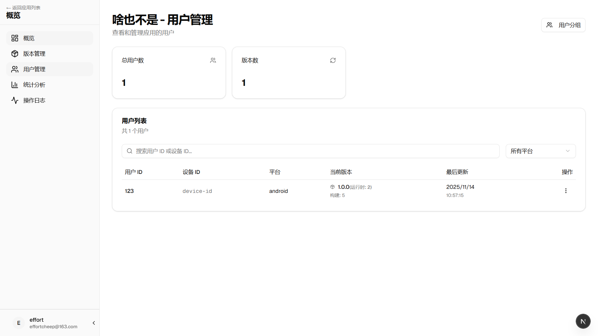
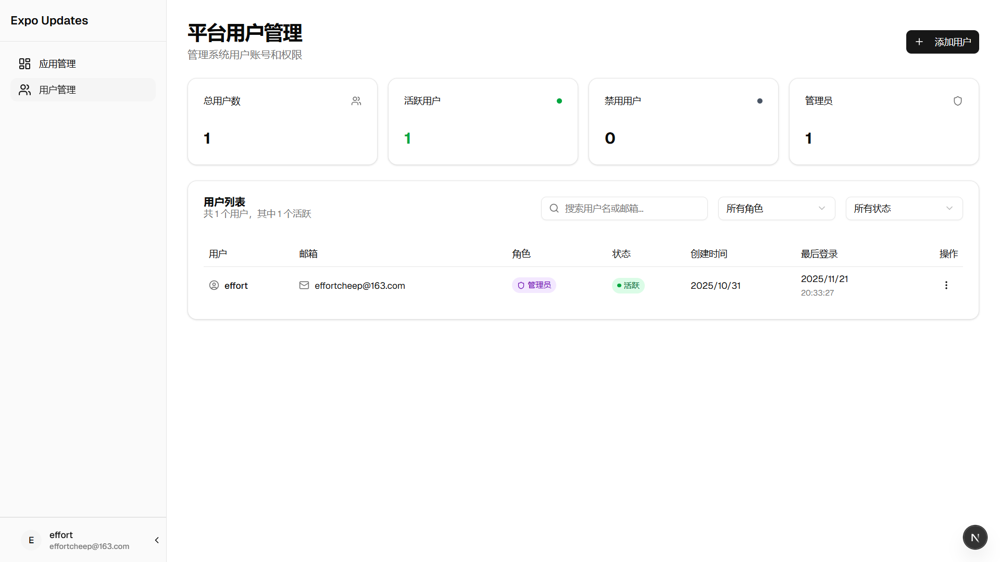
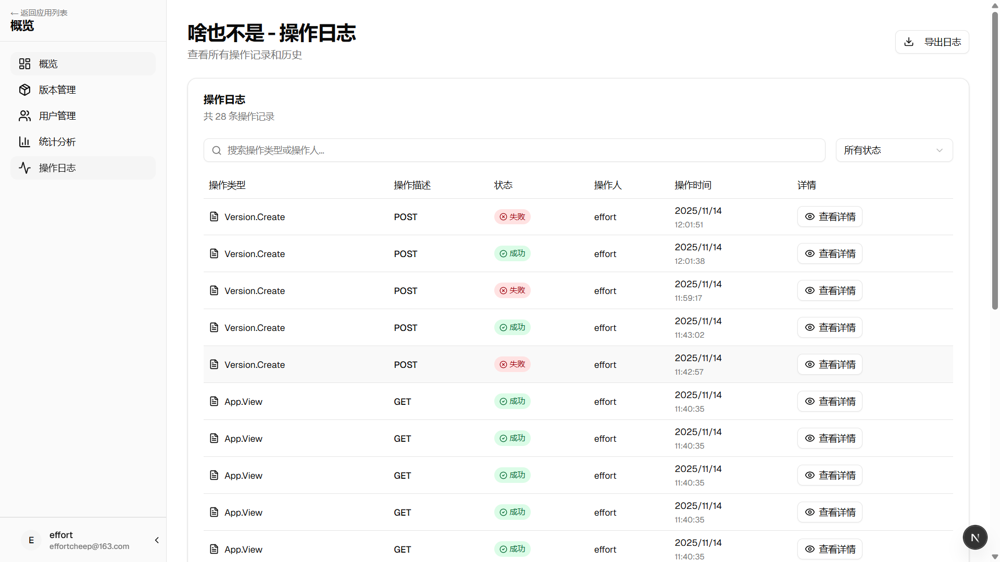
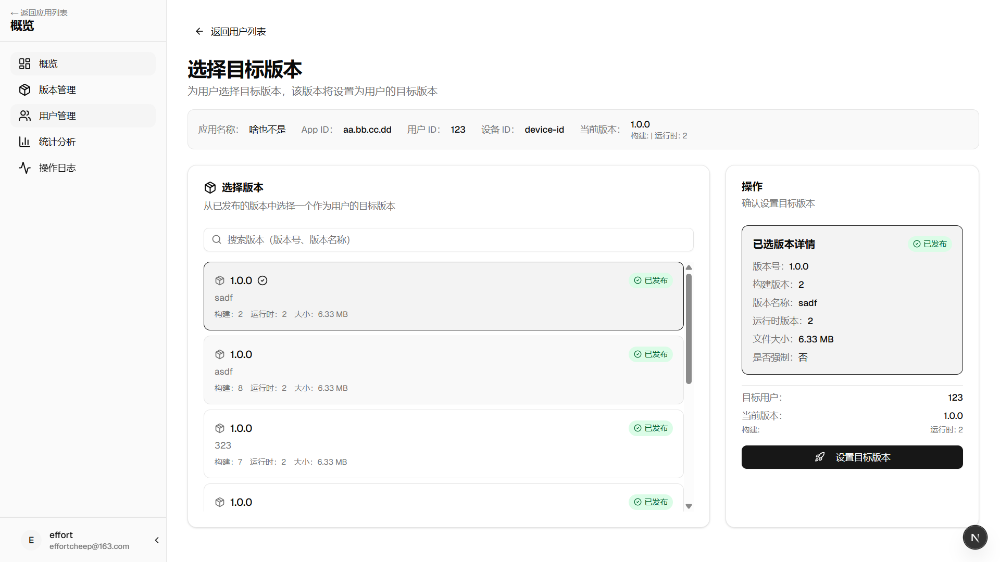

# Expo Updates Admin

> 面向 Expo 应用热更新场景的开源管理端，提供版本发布、用户分发、统计分析与操作审计能力。仓库采用 **pnpm workspaces + Turbo** 的 monorepo 架构，前端基于 **Next.js 15 + React 19 + shadcn/ui** 构建。

## 功能亮点

- **多应用多环境管理**：集中查看所有接入的 Expo 应用、版本、分发渠道与运行状态。
- **热更新全流程**：版本上传、强制/灰度分发、批量回滚、用户定向更新全覆盖。
- **用户与分组能力**：支持管理应用内终端用户、版本历史、用户分组与定向策略。
- **可视化洞察**：内置统计/日志页面展示更新成功率、失败原因与完整操作流水。
- **UI 已完成**：所有页面 UI 均已实现，可在集成真实 API 前用于产品演示或二次开发。

## 截图预览

| 页面 | 说明 |
| --- | --- |
|  | 发布新更新：上传 .tar.gz/.zip 包、填写版本信息并提交发布。 |
|  | 应用用户管理：查看终端用户、当前版本、搜索与筛选。 |
|  | 平台账号管理：维护管理端成员、角色、状态。 |
|  | 操作日志：跟踪每一次版本创建、查看与导出操作。 |
|  | 为指定用户选择目标版本并立即下发。 |

> 更多截图位于 `./images/` 目录，可直接插入到文档或开源主页。

## 技术栈

- **框架**：Next.js 15、React 19（App Router）
- **语言**：TypeScript 5.9
- **UI**：shadcn/ui、Radix UI、Tailwind CSS 4
- **状态与表单**：React Hooks、React Hook Form、Zod
- **构建与工具**：pnpm workspaces、Turbo、ESLint、Prettier

## Monorepo 结构

```
expo-updates-admin/
├── apps/
│   └── web/                  # 管理端前端应用（Next.js）
├── packages/
│   ├── ui/                   # 共享 UI 组件库（shadcn/ui）
│   ├── eslint-config/        # 统一 ESLint 配置
│   └── typescript-config/    # 统一 TS 配置
├── docs/                     # 需求与设计文档
├── images/                   # 页面截图
├── pnpm-workspace.yaml
└── turbo.json
```

## 快速开始

### 环境要求

- Node.js ≥ 20
- pnpm ≥ 10

### 安装依赖

```bash
pnpm install
```

### 常用命令

| 命令 | 说明 |
| --- | --- |
| `pnpm run dev` | 使用 Turbo 并行启动所有开发服务（默认只包含 `apps/web`）。 |
| `pnpm --filter web dev` | 仅启动管理端应用，支持 `--turbopack` 加速本地开发。 |
| `pnpm run build` | 构建全部工作区应用/包。 |
| `pnpm run lint` | 运行统一 ESLint 规则。 |
| `pnpm run format` | 使用 Prettier 扫描并格式化 `.ts/.tsx/.md`。 |

### 本地访问

1. 执行 `pnpm --filter web dev -- --turbopack`。
2. 浏览器访问 `http://localhost:3000` 查看管理端页面。
3. 目前页面使用模拟数据，后续可在 `apps/web/lib/api/` 中对接真实后端。

## 工作区与包说明

- `apps/web`：管理端前端。所有页面位于 `app/` 目录，调用位于 `lib/api` 的模拟 API。
- `packages/ui`：集中维护 shadcn 组件（`src/components`）、工具函数（`src/lib`）与全局样式。
- `packages/eslint-config`：封装 `base`/`next`/`react-internal` 规则，供所有包复用。
- `packages/typescript-config`：封装 `base`、`nextjs`、`react-library` 配置，保持类型一致性。

## 功能实现进度

| 模块 | 状态 | 说明 |
| --- | --- | --- |
| UI 界面 | ✅ 完成 | 包含登录、应用、版本、用户、统计、日志等所有页面。 |
| 模拟数据 | ✅ 完成 | `lib/api` 下提供静态数据和类型定义，可快速联调。 |
| 后端 API 集成 | 🚧 进行中 | 需将接口指向真实服务，并实现鉴权/版本管理逻辑。 |
| 自动化测试 | ⏳ 规划中 | 建议补充 E2E 与接口层测试。 |

更详细的需求与待办请阅读 `docs/requirements.md`。

## 文档

- [需求文档](./docs/requirements.md)：完整的功能说明与实现状态。
- [API 草案](./docs/api.md / ./docs/expo-update-api.json)：接口约定示例。
- [技术规范](./.cursor/rules/general.mdc 等)：团队约定的代码与文档规范。

## 贡献指南

1. Fork 或创建新的 feature 分支。
2. 保持所有修改通过 `pnpm run lint` 与 `pnpm run build`。
3. 更新相关文档（如 README、docs/requirements.md）。
4. 提交 Pull Request，描述变更动机与测试情况。

## 许可证

目前尚未指定许可证，如需以特定协议开源，请在确定后更新此章节。
